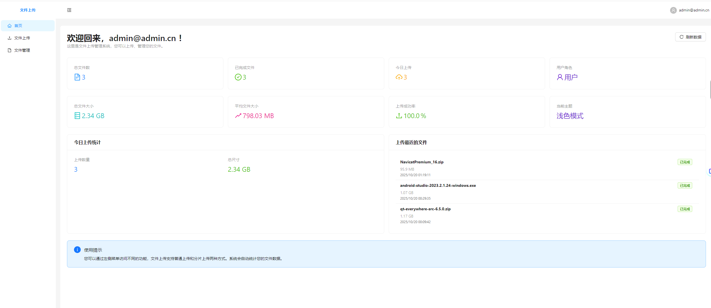

<h1 align="center">基于GO+React实现文件分片上传</h1>
<div align="center">
  <a href="https://golang.org/"></a>
  <a href="https://www.mysql.com/"></a>
  <a href="https://github.com/gorilla/mux"></a>
  <a href="https://github.com/rs/cors"></a>
  <a href="https://github.com/go-sql-driver/mysql"></a>
  <a href="./LICENSE"></a>
  <a href="你的微信链接"></a>

  <a href="https://react.dev/"></a>
<a href="https://vitejs.dev/"></a>
<a href="https://www.typescriptlang.org/"></a>
</div>

一个用 Go 语言编写的强大且可扩展的文件上传服务，支持分片上传、断点续传、进度跟踪和文件历史管理。服务使用 MySQL 数据库存储元数据，并提供 RESTful API 用于创建上传任务、上传分片、检查上传状态以及获取文件历史和统计信息。


## 功能特性
- **分片文件上传**：通过将大文件分解为较小分片实现高效上传，支持断点续传。
- **进度跟踪**：提供实时上传进度和状态查询。
- **文件历史**：支持分页、过滤和排序的文件上传历史记录查询。
- **统计信息**：提供总文件数、已完成上传数、每日统计等洞察。
- **并发上传处理**：使用互斥锁确保并发上传的安全性。
- **CORS 支持**：支持可配置的跨源资源共享，适用于 Web 应用。
- **健康检查**：提供服务状态监控端点。

## 技术栈
- **Go**：高效的后端编程语言。
- **MySQL**：存储上传元数据的数据库。
- **Gorilla Mux**：HTTP 路由器。
- **rs/cors**：跨源资源共享支持。
- **go-sql-driver/mysql**：MySQL 数据库驱动。
- **React**:react+ts+react-router+react-redux


## 效果截图



## 目录结构
```
golang-file-chunk-upload
├── client
│   ├── client.go
│   ├── go.mod
│   └── readme.md
├── file-upload-vite
│   ├── public
│   │   └── vite.svg
│   ├── src
│   │   ├── assets
│   │   ├── components
│   │   ├── constants
│   │   ├── hooks
│   │   ├── pages
│   │   ├── routes
│   │   └── .....
│   ├── README.md
│   ├── env.production
│   ├── eslint.config.js
│   └── vite.config.ts
├── sql
│   └── filedb.sql
├── LICENSE
├── go.mod
├── output.md
├── readme.md
└── server.go

```

- **`client/`**: 包含前端代码，使用 Vite 和 TypeScript 构建。
- **`sql/`**: 包含 `filedb.sql` 用于初始化数据库。
- **`store/`**: 存储合并后的文件。
- **`tmp_uploads/`**: 临时存储上传的分片。
- **`server.go`**: 后端主程序。

## 安装与设置
1. **克隆项目**：
   ```bash
   git clone <repository-url>
   cd GOLANG-FILE-CHUNK-UPLOAD
   ```

2. **安装依赖**：
   ```bash
   go mod tidy
   cd client/file-upload-vite
   npm install
   ```

3. **配置数据库**：
   - 确保 MySQL 服务运行。
   - 创建数据库 `filedb` 并导入 `sql/filedb.sql`：
     ```bash
     mysql -u root -p < sql/filedb.sql
     ```
   - 更新 `server.go` 中的数据库连接字符串（DSN）以匹配您的 MySQL 配置：
     ```go
     dsn := "root:your_password@tcp(127.0.0.1:3306)/filedb?parseTime=true"
     ```

4. **配置环境**：
   - 确保 `tmp_uploads` 和 `store` 目录具有写权限：
     ```bash
     chmod -R 755 tmp_uploads store
     ```
   - 配置前端环境变量（见 `client/file-upload-vite/env` 文件）。

5. **运行服务**：
   - 启动后端：
     ```bash
     go run server.go
     ```
   - 启动前端（可选）：
     ```bash
     cd client/file-upload-vite
     npm run dev
     ```

## API 文档
### 1. 创建上传任务
- **端点**: `POST /api/v1/uploads`
- **请求体**:
  ```json
  {
    "file_name": "example.txt",
    "total_size": 1048576,
    "chunk_size": 262144,
    "md5": "optional_md5_hash"
  }
  ```
- **响应**:
  ```json
  {
    "upload_id": "unique_id",
    "chunk_size": 262144,
    "total_chunks": 4
  }
  ```
- **状态码**: 201 (Created)

### 2. 获取上传状态
- **端点**: `GET /api/v1/uploads/{upload_id}`
- **响应**:
  ```json
  {
    "upload_id": "unique_id",
    "status": "in_progress",
    "chunks": [0, 1],
    "progress": {
      "completed": 2,
      "total": 4,
      "percent": 50
    }
  }
  ```
- **状态码**: 200 (OK)

### 3. 上传分片
- **端点**: `PUT /api/v1/uploads/{upload_id}/chunks/{index}`
- **请求体**: 二进制数据
- **响应**:
  ```json
  {
    "index": 0,
    "size": 262144,
    "md5": "chunk_md5_hash"
  }
  ```
- **状态码**: 201 (Created)

### 4. 完成上传
- **端点**: `POST /api/v1/uploads/{upload_id}/complete`
- **响应**:
  ```json
  {
    "status": "completed",
    "final_path": "./store/unique_id_example.txt",
    "file_size": 1048576,
    "md5": "file_md5_hash"
  }
  ```
- **状态码**: 200 (OK)

### 5. 获取文件历史
- **端点**: `GET /api/v1/files/history?page=1&per_page=20&status=completed&keyword=example&sort_by=created_at&order=desc`
- **响应**:
  ```json
  {
    "total": 10,
    "page": 1,
    "per_page": 20,
    "files": [
      {
        "upload_id": "unique_id",
        "file_name": "example.txt",
        "file_size": 1048576,
        "status": "completed",
        "chunk_size": 262144,
        "total_chunks": 4,
        "created_at": "2025-10-19T19:00:00Z",
        "updated_at": "2025-10-19T19:30:00Z",
        "completed_at": "2025-10-19T19:30:00Z"
      }
    ]
  }
  ```
- **状态码**: 200 (OK)

### 6. 获取文件详情
- **端点**: `GET /api/v1/files/{upload_id}`
- **响应**: 类似文件历史中的单个记录。
- **状态码**: 200 (OK)

### 7. 获取文件统计
- **端点**: `GET /api/v1/files/stats`
- **响应**:
  ```json
  {
    "data": {
      "total_count": 50,
      "completed_count": 45,
      "total_size": 52428800,
      "today_upload_count": 5,
      "success_rate": 90,
      "average_file_size": 1048576
    }
  }
  ```
- **状态码**: 200 (OK)

### 8. 获取今日上传统计
- **端点**: `GET /api/v1/files/today-stats`
- **响应**:
  ```json
  {
    "data": {
      "count": 5,
      "total_size": 5242880
    }
  }
  ```
- **状态码**: 200 (OK)

### 9. 获取最近上传文件
- **端点**: `GET /api/v1/files/recent?limit=5`
- **响应**:
  ```json
  {
    "data": [
      {
        "upload_id": "unique_id",
        "file_name": "example.txt",
        "file_size": 1048576,
        "status": "completed",
        "created_at": "2025-10-19T19:00:00Z",
        "updated_at": "2025-10-19T19:30:00Z"
      }
    ]
  }
  ```
- **状态码**: 200 (OK)

### 10. 健康检查
- **端点**: `GET /api/v1/health`
- **响应**:
  ```json
  {
    "status": "healthy",
    "timestamp": "2025-10-19T10:29:00Z",
    "version": "1.0.0"
  }
  ```
- **状态码**: 200 (OK)

## 使用示例
### 创建上传任务
```bash
curl -X POST http://localhost:8080/api/v1/uploads \
-H "Content-Type: application/json" \
-d '{"file_name":"example.txt","total_size":1048576,"chunk_size":262144}'
```

### 上传分片
```bash
curl -X PUT http://localhost:8080/api/v1/uploads/{upload_id}/chunks/0 \
-H "Content-Type: application/octet-stream" \
--data-binary @chunk_0
```

### 获取上传状态
```bash
curl http://localhost:8080/api/v1/uploads/{upload_id}
```

### 完成上传
```bash
curl -X POST http://localhost:8080/api/v1/uploads/{upload_id}/complete
```

## 注意事项
- 确保 MySQL 数据库正确配置并运行。
- 服务默认监听在 `:8080` 端口，可在 `server.go` 中修改。
- 上传分片存储在 `tmp_uploads`，合并文件存储在 `store`。
- 服务支持 CORS，适合前端集成。

## 联系方式
<div align="left">


  <a href="mailto:2862440280@qq.copm">
    
  </a>
    <a href="./LICENSE">
    
  </a>
</div>


